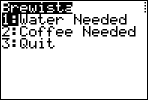
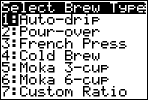
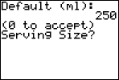
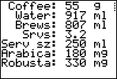

# brewista
Coffee brew ratio app for Casio and TI-84 calculators. 

This app is written in BASIC language for TI-84 series calculators (84+, CE, and likely the Evo) and the Casio fx-9860Giii, fx-9750Giii, fx-CG50 and similar calculators. It calculates the optimal dosage of water and coffee for various brewing methods. Additionally, it calculates the amount of the finished brew, as well as caffeine per serving.

## Installation

See the documentation the came with your calculator for more details on installing software from a PC or Mac.

### TI 84
Download the `.8xp` file.  Using a USB cable, install from a PC or Mac using TI Connect CE software. 

### Casio
Download the `.g1m` file.  Using a USB cable, install from a PC or Mac into the @MainMem/PROGRAM folder in the calculator's storage. 

## Usage

Brewista is an app to help you brew fresh, delicious and flavorful coffee.

### Getting Started

Launch the program on your calculator. On the TI, press the `PRGM` key and select from the menu. On the Casio, press `MENU`, then select `PRGM`, then select the app from the menu.

### Data Entry

The program opens with the following screen:

Choose *Water Needed* to calculate the water necessary for a given amount of ground coffee, or *Coffee Needed* to determine the proper amount of ground coffee for a given amount of water.

The next screen displays a set of brewing methods.

Choose a method, and the calculator determines the proper brew ratio for that style of brewing.

* *Auto-drip*: Automatic drip coffee makers (ratio: 18 parts water:1 part coffee by weight)
* *Pour-over*: Single serving pourovers, using a pourover dripper such as a Chemex, Hario V60 or Melitta (ratio: 16.6:1)
* *French Press*: Coffee steeped in a French Press pot (ratio: 15:1)
* *Cold Brew*: Cold brew coffee concentrate, brewed at room temperature or in the refrigerator for 12-24 hours (ratio: 5:1)
* *Moka 3-cup*: Coffee brewed in a 3-cup Moka Pot (ratio: approximately 8:1)
* *Moka 6-cup*: Coffee brewed in a 6-cup Moka Pot (ratio: approximately 8.5:1)
* *Custom Ratio*: Enter a custom brew ratio (in parts water, i.e. X parts water to 1 part coffee)

Next, you'll be asked for the amount of coffee or water you have to brew.  Enter an amount in grams (for water, 1 milliliter weighs 1 gram).  

If you chose one of the Moka Pot brew methods, you will not be asked for an amount, as the water and coffee measures are fixed by the size of the Moka Pot.

The next screen asks for a serving size (in ml). 

Enter `0` to accept its default suggestion (usually 250 ml, but varies depending upon the chosen brewing method), or enter your own serving size.

### Results

The calculator displays the following results for your brew:

* *Coffee*: Dose of ground coffee in grams
* *Water*: Dose of water in milliliters
* *Srvs*: Number of servings given the volume of brewed coffee, and the chosen serving size
* *Serv Sz*: Serving size in milliliters, as previously entered
* *Arabica*: Caffeine per serving (in mg), assuming 100% Arabica beans
* *Robusta*: Caffeine per serving (in mg), assuming 100% Robusta beans

Note that the calculations for volume of brewed coffee and caffeine content are estimates based on averages, and will vary depending on the selection of coffee bean.

Press the `ENTER` (TI) or `EXE` key (Casio) to return to the main menu.
